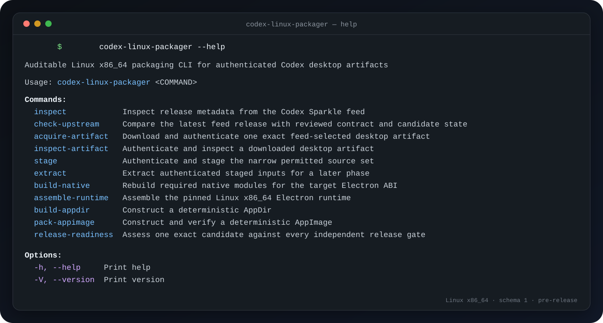

# codex-linux-packager

<p align="center">
  <strong>An auditable, deterministic Linux x86_64 packaging pipeline for authenticated Codex desktop artifacts.</strong>
</p>

<p align="center">
  Clean-room Rust tooling · schema-1 provenance · exact-input contracts · no bundled application payloads
</p>

<p align="center">
  <a href="https://github.com/BearHuddleston/codex-linux-packager/actions/workflows/ci.yml"></a>
  <a href="LICENSE"></a>
  
</p>

<p align="center">
  <a href="#quick-start">Quick start</a> ·
  <a href="#pipeline">Pipeline</a> ·
  <a href="#in-app-updates">In-app updates</a> ·
  <a href="#automatic-rebuilds">Automatic rebuilds</a> ·
  <a href="#security-contract">Security</a> ·
  <a href="#release-boundary">Release boundary</a> ·
  <a href="#development">Development</a>
</p>

<p align="center">
  
</p>

> [!IMPORTANT]
> This project is pre-release, unofficial, and unaffiliated with OpenAI. No
> public or stable AppImage is approved. The MIT license covers this
> repository's original tooling only; it does not grant payload redistribution
> or trademark rights.

## At a glance

| Contract | Current value |
| --- | --- |
| Supported target | Linux x86_64 only |
| Toolchain | Stable Rust; MSRV 1.85.0 |
| Electron | 42.3.0 / module ABI 146 |
| Native build baseline | Debian Bookworm / GLIBC 2.36 |
| Version-matched inputs | Codex CLI 0.146.0-alpha.3.1 / ripgrep 15.2.0 |
| Persisted documents | Schema `1`, deterministic compact JSON |
| Producer | `io.github.bearhuddleston.codex-linux-packager.rust` |
| Last local candidate | Codex 26.721.81911 build 5973; [digest record](data/engineering-candidate.json) |
| Updates | Pinned Ed25519 manifest; full-file SHA-256; atomic next-launch activation |
| Automation | Hourly public monitor; protected candidate rebuild and draft-release workflows |
| Release status | Engineering candidate built; public AppImage publication blocked |

The tool authenticates one official desktop artifact, narrows it to the
permitted source set, rebuilds native dependencies for the exact Electron ABI,
assembles a Linux runtime, and verifies a deterministic AppImage. Every phase
emits evidence for the next phase to validate independently.

## Quick start

Build the CLI from the locked dependency graph:

```bash
git clone https://github.com/BearHuddleston/codex-linux-packager.git
cd codex-linux-packager
cargo build --locked
./target/debug/codex-linux-packager --help
```

Inspect the fixed official Sparkle feed:

```bash
cargo run --locked -- inspect
```

Compare the feed with the reviewed contract and last engineering candidate:

```bash
cargo run --locked -- check-upstream
```

Or exercise the same bounded parser offline with a synthetic local fixture:

```bash
cargo run --locked -- inspect --fixture /absolute/path/to/feed.xml
```

`inspect` emits the exact `signature`, `length`, `version`, and `build` required
by the artifact-acquisition and authentication commands. `acquire-artifact`
downloads only the exact official URL for that version, rejects redirects and
ambiguous HTTP responses, authenticates the complete bytes with the
independently compiled production trust root, and publishes with no
replacement.

When a public release is eventually authorized, end users will download the
single `codex-desktop-unofficial-x86_64.AppImage` asset from this repository's
Releases page, mark it executable, and launch it:

```bash
chmod +x codex-desktop-unofficial-x86_64.AppImage
./codex-desktop-unofficial-x86_64.AppImage
```

There is no public AppImage attached today. The install contract is documented
now so it does not have to change when the remaining release gates are cleared.

## Pipeline

```text
hourly monitor ──► check-upstream ──► review changed contracts
                         │                    │
                         │ contract current   │ reviewed merge
                         ▼                    ▼
Sparkle feed ──► inspect ──► acquire-artifact ──► stage ──► extract
                                                        │
                                                        ▼
                                                 build-native
                                                        │
                                                        ▼
                                                assemble-runtime
                                                        │
                                                        ▼
                                                  build-appdir ×2
                                                        │
                                                        ▼
                                                 pack-appimage
                                                        │
                                                        ▼
                                               release-readiness
                                                        │
                                                        ▼
                                                   sign-update
                                                        │
                                                        ▼
                                                 prepare-release
                                                        │
                                                        ▼
                                                  verify-release
                                                        │
                                             protected environments
                                                        ▼
                                              non-public draft only
```

| Command | Responsibility | Result |
| --- | --- | --- |
| `inspect` | Parse the fixed feed or a bounded local fixture | Typed release metadata |
| `check-upstream` | Compare latest feed, reviewed application contract, and last candidate | `current`, `review_contract_update`, or `rebuild_candidate` |
| `acquire-artifact` | Download, authenticate, preflight, and no-replace publish the exact feed-selected ZIP | Authenticated source ZIP plus acquisition receipt |
| `inspect-artifact` | Authenticate and preflight the complete desktop ZIP | Reconciled artifact report |
| `stage` | Publish only the authenticated ZIP, `app.asar`, and provenance | Private schema-1 stage generation |
| `extract` | Expand integrity-verified packed ASAR files | New no-replace extraction generation |
| `build-native` | Rebuild the locked `better-sqlite3` and `node-pty` graph | Verified Linux x86_64 native outputs |
| `assemble-runtime` | Combine pinned Electron, Codex CLI, ripgrep, and native inputs | Normalized runtime plus complete manifest |
| `build-appdir` | Construct the deterministic filesystem, updater, config, and launcher | Timestamp- and mode-normalized AppDir |
| `pack-appimage` | Build twice, compare, extract, audit, and launch | Byte-reproducible AppImage plus provenance |
| `generate-update-key` | Create a no-replace mode-0600 Ed25519 seed while emitting only its public identity | Protected local signing seed and public pin |
| `sign-update` | Reconcile exact AppImage provenance and sign immutable-tag release metadata | Canonical pinned-key update manifest |
| `prepare-release` | Reconcile the assessed artifact set, generate SPDX/notices/checksums, and sign its exact commit/tree binding | Four-file no-replace release-evidence generation |
| `verify-release` | Rehash every release asset and keylessly verify canonical evidence against the compiled pin | Exact-set verification receipt |
| `release-readiness` | Re-authenticate the full evidence chain and evaluate gates | Truthful blocking release assessment |

Run `codex-linux-packager <command> --help` for every typed argument. Build and
assessment commands require absolute paths. Acquired inputs and generated
outputs belong beneath ignored `work/`, `cache/`, `build/`, `out/`, or `dist/`
directories.

### What the completed pipeline verifies

- Ed25519 authentication covers the exact complete downloaded artifact bytes.
- ZIP and ASAR inputs are bounded and preflighted before narrow extraction.
- Native modules are rebuilt for Electron ABI 146 and must pass real SQLite
  and PTY round trips under the exact runtime.
- Runtime assembly includes only the Linux x86_64 policy set and inventories
  every inclusion and omission.
- AppImages are built from independent roots with network-isolated packaging
  and must be byte-identical.
- The final AppImage is extracted, matched to AppDir provenance, and exercised
  on host Wayland, host X11, and a controlled older-GLIBC baseline.
- Every extracted ELF requirement is recorded; `release-readiness` rejects a
  recorded GLIBC requirement above 2.36.
- The AppDir contains a separately inventoried Rust updater and immutable
  schema-1 config bound to the compiled release-key fingerprint.
- Release evidence contains deterministic SPDX 2.3 JSON, an inventory of
  embedded notice-like files and Rust license identifiers observed by the
  pinned policy tool, sorted
  `SHA256SUMS`, and a pinned Ed25519 attestation over the exact commit, tree,
  lockfile, manifests, evidence, and AppImage.

`build-native` is offline by default and uses the digest-addressed OCI image in
[`data/native-contract.json`](data/native-contract.json). Its explicit
`--allow-network` flag is recorded in provenance. `pack-appimage` requires two
independently constructed AppDirs, digest-matched packaging tools, both Wayland
and X11 backends, and the exact locally verified older-GLIBC image ID.

## In-app updates

The packaged launcher starts `codex-linux-updater` quietly beside Codex whenever
the application is launched from a writable Type-2 AppImage. It downloads a
small canonical manifest from the fixed GitHub Releases URL, verifies its
Ed25519 signature against the independently compiled key in
[`data/update-contract.json`](data/update-contract.json), and accepts only a
strictly newer Linux x86_64 version/build.

For an accepted release, the updater:

1. downloads the complete AppImage with bounded headers, a strict
   `Content-Length`, and no content decoding;
2. verifies the signed byte count, full SHA-256, and Linux x86_64 Type-2
   AppImage identity;
3. uses Linux `RENAME_EXCHANGE` to activate it atomically at the existing path;
4. retains the previous bytes as
   `<name>.rollback-<version>-<build>`; and
5. leaves the running process untouched—the new bytes take effect on the next
   launch.

No key from a downloaded manifest is trusted, no delta is executed, and the
official Codex payload is not modified. The release signer emits manifests with
`sign-update`; its private seed is never stored in Git and must be held by a
protected release environment. Standard AppImage `.zsync` metadata is not the
security boundary: this implementation deliberately verifies a signed
full-file digest before activation.

Run a foreground check with:

```bash
./codex-desktop-unofficial-x86_64.AppImage --codex-linux-update-now
```

Set `CODEX_LINUX_DISABLE_UPDATES=1` to suppress the background check. Updates
cannot replace a symlink launch path or an AppImage in a read-only directory;
download a fresh release manually in those cases. Atomic exchange guarantees
the committed bytes under the documented threat model, not permanent
immutability against the owning UID.

## Automatic rebuilds

The public [`upstream-monitor.yml`](.github/workflows/upstream-monitor.yml)
runs hourly and can also be dispatched manually. It reads only the official
feed and repository contracts. A new release opens or refreshes an
`upstream-update` issue.

The transition is deliberately two-step:

1. `review_contract_update` means the feed moved. Automation stops until the
   downloaded source is authenticated and every Electron, native-package,
   Codex CLI, ripgrep, patch, and tool pin is independently reconciled in a
   reviewed change.
2. `rebuild_candidate` means that reviewed contract is current while the
   candidate record is stale. If `TRUSTED_REBUILD_ENABLED=true`, the monitor
   dispatches [`rebuild-candidate.yml`](.github/workflows/rebuild-candidate.yml)
   to a dedicated `codex-packager-trusted` runner.

That trusted workflow acquires the exact source, builds both Rust executables,
executes every implemented phase offline where required, builds the AppImage
twice, performs real Wayland/X11 and older-GLIBC launches, retains the result
beneath a configured local output root, and opens a pull request containing
only the new digest record. It does not upload the AppImage or create a release.
The payload-handling job has read-only repository permission and no persisted
checkout credential; only a separate GitHub-hosted digest-record job can write
the pull request.

No matching self-hosted runner or enablement variable is installed by cloning
the repository. Configure a dedicated or ephemeral runner and its reviewed
cache before enabling dispatch; do not expose a general-purpose user
workstation to untrusted workflows. The exact operational contract is in
[`docs/automated-rebuilds.md`](docs/automated-rebuilds.md).

After that digest record is reviewed and merged, the manual
[`release-draft.yml`](.github/workflows/release-draft.yml) workflow can select
only a retained generation whose AppImage, AppDir manifest, provenance,
Cargo.lock, and full release-readiness scope match the merged record. A
read-only `release-signing` job generates and verifies signed evidence; a
separate `release-draft` job receives repository write permission but no
signing seed, re-verifies the handoff, creates a non-public GitHub draft, then
redownloads and verifies every asset.

That workflow has no public-release step. Its source is implemented and tested,
but protected environments, reviewer separation, pinned runner tools, key
custody, and a real draft exercise must still be configured and reviewed.

## Security contract

The binding scope is [`docs/threat-model.md`](docs/threat-model.md).

The implementation is designed to reject malformed, oversized, ambiguous,
truncated, unauthenticated, path-unsafe, or resource-exhausting inputs. It uses
bounded reads and subprocess output, no-follow file opens, deterministic
environments, process-group cleanup, and no-replace publication.

The application-update key is independent of the official Sparkle artifact key.
The Sparkle key authenticates downloaded desktop source; the update key
authenticates this project's final Linux release bytes. Neither downloaded
artifact nor update metadata can authorize its own key rotation.

Publication guarantees the bytes produced at the documented durable commit
boundary. It does **not** make ordinary user-owned files permanently immutable
against a hostile process running as the same UID. Stronger same-UID guarantees
would require a separately privileged publisher or kernel-enforced immutable
storage—not another userspace verifier.

## JSON and provenance

Machine-readable documents:

- begin at schema `1`;
- require producer
  `io.github.bearhuddleston.codex-linux-packager.rust`;
- deny unknown fields, unknown or old schemas, and other producers;
- use one compact UTF-8 JSON document followed by a newline; and
- inventory paths, byte counts, modes, and SHA-256 identities.

There is no implicit compatibility with Python schema-3 staging state. Each
consumer revalidates both the identity and semantics of the evidence it reads.

## Release boundary

`release-readiness` validates the stage, native, runtime, AppDir, AppImage,
artifact, and Cargo lockfile chain. A successful invocation means only that the
assessment completed. Read `stable_publication_permitted` and
`blocking_gate_ids`; with the current cataloged gates, the expected publication
value is `false`.

Stable publication remains blocked on independent completion and review of
notices and SBOM licensing assertions, protected operation of the implemented
signing and draft-release path, a complete desktop and FUSE matrix,
publication rollback/recovery rehearsal, and frozen review of one exact commit
and artifact digest set. The deterministic SPDX, notice inventory, checksums,
attestation, and keyless verifier are implemented; their existence does not
clear those operational gates. See
[`docs/release-gates.md`](docs/release-gates.md).

The gate catalog deliberately does not decide whether a publisher has payload
redistribution or trademark authority. Those are publisher responsibilities
outside `release-readiness`; `stable_publication_permitted` is not a legal
opinion.

In particular, “automatic rebuild” does not yet mean “automatic public
release.” The source repository is public; the generated AppImage is not
currently a GitHub release. The updater becomes useful when an authorized
release channel starts publishing signed manifests and their exact AppImages.

## Repository boundary

Git must never contain OpenAI or Codex application payloads, extracted bundles,
branding assets, native modules, executables, credentials, private keys, or
build products. Tests use small synthetic fixtures; live-network and
proprietary-input tests are explicitly opt in.

[`tests/repository_boundary.rs`](tests/repository_boundary.rs) checks the
candidate Git tree for prohibited archives, binary content, symlinks, oversized
files, obvious credential paths, and private-key material. The terminal image
above is an original UTF-8 SVG containing only the CLI's public help text.

## Development

Work vertically with RED → GREEN → REFACTOR. Run the canonical gates directly
from the repository root:

```bash
cargo test --all-targets --all-features
cargo clippy --all-targets --all-features -- -D warnings
cargo fmt --all -- --check
cargo audit
cargo deny check
```

Useful project documents:

| Document | Purpose |
| --- | --- |
| [`AGENTS.md`](AGENTS.md) | Repository workflow and canonical commands |
| [`docs/architecture.md`](docs/architecture.md) | Implemented data flow and trust boundaries |
| [`docs/threat-model.md`](docs/threat-model.md) | Binding security scope |
| [`docs/release-gates.md`](docs/release-gates.md) | Engineering evidence versus publication approval |
| [`docs/automated-rebuilds.md`](docs/automated-rebuilds.md) | Scheduled detection and trusted-runner operating contract |
| [`docs/update-signing.md`](docs/update-signing.md) | Pinned AppImage update key and protected signing contract |
| [`docs/dependencies.md`](docs/dependencies.md) | Exact dependency-selection rationale |
| [`docs/decisions/`](docs/decisions/) | Accepted architecture decision records |

## License

The original packaging and validation tooling in this repository is available
under the [MIT License](LICENSE). No OpenAI application payload, trademark, or
branding right is included or implied.
